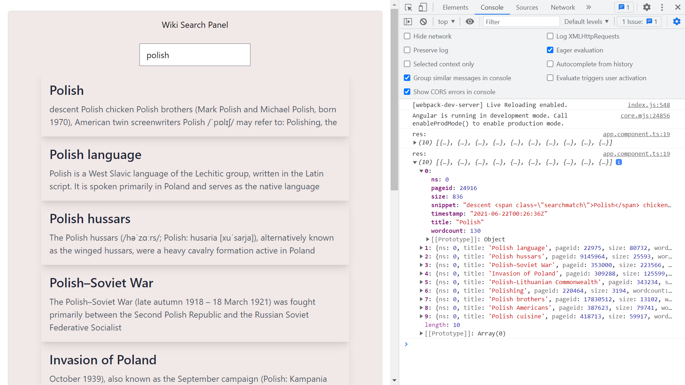

# :zap: Angular RxJS API

* Angular app to fetch Wikipedia API data and display it on cards using asynchronous reactive programming observables
* Tailwind styling used for search form and search results cards
* **Note:** to open web links in a new window use: _ctrl+click on link_


## :page_facing_up: Table of contents

* [:zap: Angular RxJS API](#zap-angular-rxjs-api)
  * [:page_facing_up: Table of contents](#page_facing_up-table-of-contents)
  * [:books: General info](#books-general-info)
  * [:camera: Screenshots](#camera-screenshots)
  * [:signal_strength: Technologies](#signal_strength-technologies)
  * [:floppy_disk: Setup](#floppy_disk-setup)
  * [:wrench: Testing](#wrench-testing)
  * [:computer: Code Examples](#computer-code-examples)
  * [:cool: Features](#cool-features)
  * [:clipboard: Status, Testing & To-Do List](#clipboard-status-testing--to-do-list)
  * [:clap: Inspiration](#clap-inspiration)
  * [:file_folder: License](#file_folder-license)
  * [:envelope: Contact](#envelope-contact)

## :books: General info

* Displays Wikipedia API JSON search data
* Wikipedia API does not require an API key
* [RxJS pluck operator](https://www.learnrxjs.io/learn-rxjs/operators/transformation/pluck) used

## :camera: Screenshots



## :signal_strength: Technologies

* [Angular v14](https://angular.io/) Javascript framework
* [Rxjs v7](https://rxjs.dev/) Reactive Extensions Library for JavaScript
* [Tailwind CSS v3](https://tailwindcss.com/) styling, minimises build bundle size
* [Wikipedia API](https://www.mediawiki.org/wiki/API:Tutorial)
* [json2ts](http://json2ts.com/) used to generate TypeScript interfaces from JSON

## :floppy_disk: Setup

* Install dependencies using `npm i`
* Run `ng serve` for a dev server. Frontend will open at `http://localhost:4200/` - refreshes on code changes
* Run `npm run build` to create build folder

## :wrench: Testing

* Run `ng test` to run Jasmine unit tests via [Karma](https://karma-runner.github.io). Testing not set up

## :computer: Code Examples

* Article card using Tailwind CSS styling and data-binding of search results

```typescript
<article class="flex flex-wrap max-w-xl mx-auto shadow-lg md:flex-nowrap">
  <div class="p-4 my-auto">
    <h1 class="text-2xl font-semibold text-gray-800">{{ article.title }}</h1>
    <p class="mt-2 text-base text-gray-600" [innerHTML]="article.snippet">
    </p>
  </div>
</article>
```

## :cool: Features

* Small build bundle size due to Tailwind styles (288kB)

## :clipboard: Status, Testing & To-Do List

* Status: Working. Deployed to Github pages
* To-Do: Optional nav-bar and about/contact pages

## :clap: Inspiration

* [How to Structure Angular Apps in 2021](https://javascript.plainenglish.io/how-to-structure-angular-apps-in-2021-a0bdd481ad0d)
* [How do I display HTML inside an Angular binding?](https://blog.briebug.com/blog/how-do-i-display-html-inside-an-angular-binding)
* [dev.to: Setup TailwindCSS in Angular the easy way](https://dev.to/angular/setup-tailwindcss-in-angular-the-easy-way-1i5l)

## :file_folder: License

* This project is licensed under the terms of the MIT license.

## :envelope: Contact

* Repo created by [ABateman](https://github.com/AndrewJBateman), email: gomezbateman@gmail.com
